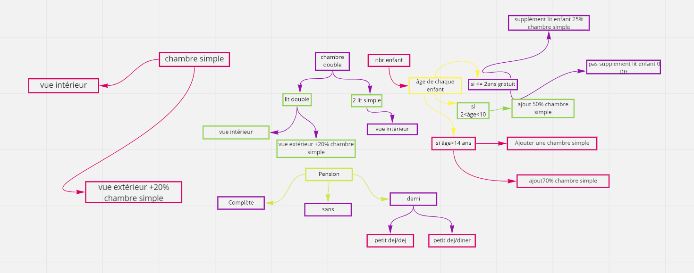

# Brief5/Maison d'hôte/Réservation d'un Hôtel  

Dans le cadre d’amélioration de son service en ligne une maison d'hôte/hôtel vous a contacté afin de renforcer son existence sur le marché. 
le  site de la maison d'hôte permet à un client de réserver deux type de chambre double ou simple, ainsi que des apparts et des bungalow
le client est définit par son Nom est son prénom, email,password
une réservation peut contenir de un à plusieurs chambres,bungalow…
un bien est défini par son nom, type, vue,.. 
vous êtes amenées à créer un site qui contient:
une page d'accueil qui représente vos produits et services
une page d’authentification
une page de réservation: contient un formulaire interactif selon le schéma en PJ

# Vous êtes amenés à réaliser:
<ol>
  <li>le diagramme de cas d’utilisation</li>
  <li>le diagramme de Séquence</li>
  <ol><li>le diagramme de classe La réalisation :</li>
    <li>BDD: MySql</li>
    <li>Back-End: PHP</li>
    <li>POO</li>
  </ol>
  <li>créer une classe tarification: qui regroupe l'ensemble des tarifs</li>
  <li>respecter le model MVC</li>
  <li>Front-End: javascript, Bootstrap,SASS,CSS,HTML</li>
  </ol>
